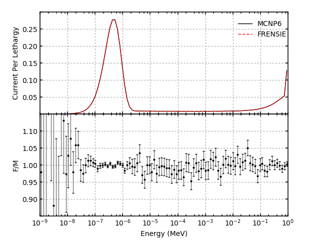
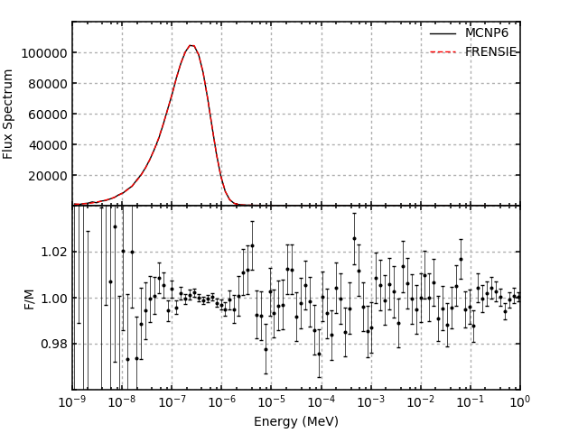
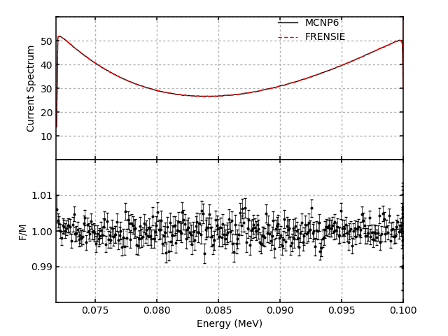
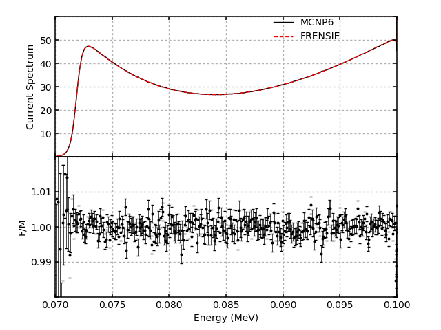
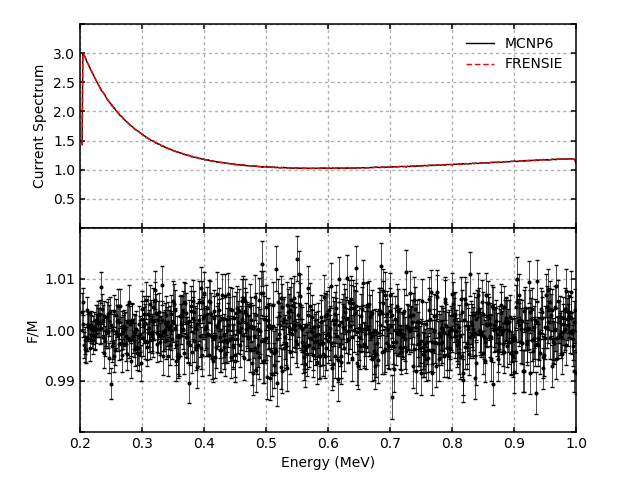
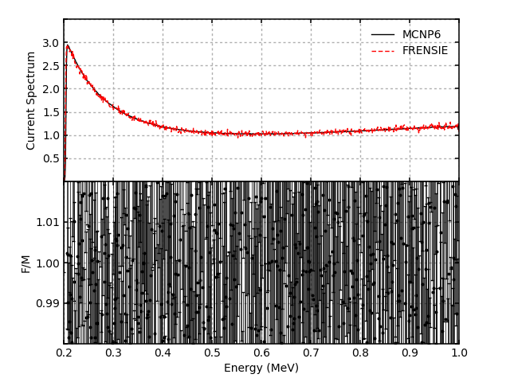
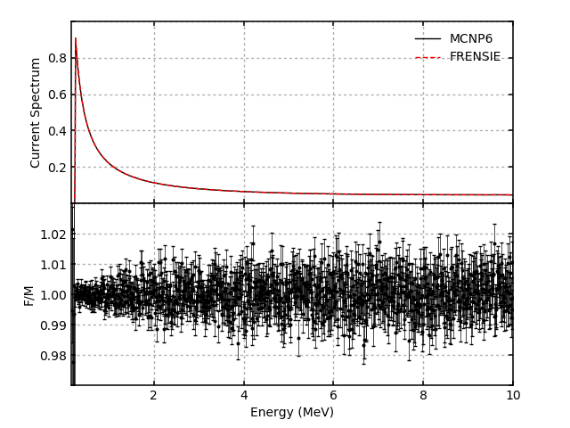
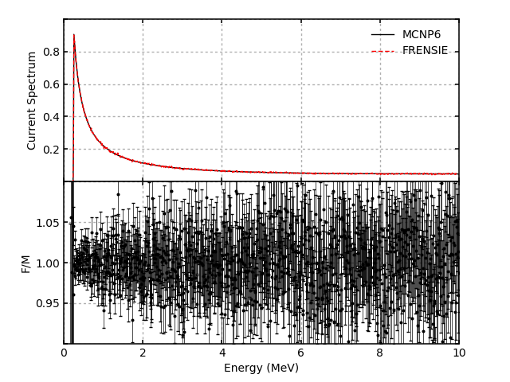

# Verification and Validation for FRENSIE

## Neutron Verification Tests

### Bare Hydrogen Sphere
All of these tests consist of a sphere of H1 with a radius of 1.0 cm and an
atom density of 1.0 atom/(b-cm) surrounded by a vacuum. The temperature of the
H1 is changed for each test to verify the free-gas thermal model
implementation. For each test both the current per lethargy and the flux
spectrum is calculated.

1. T = 293.6 K

2. T = 600 K

3. T = 900 K

4. T = 1200 K

5. T = 2500 K

## Photon Verification Tests

### Hydrogen Broomstick

1. Source Energy = 0.1 MeV, No Doppler Broadening

2. Source Energy = 0.1 MeV, Doppler Broadening (MonteCarlo.DECOUPLED_HALF_PROFILE_DB_HYBRID_INCOHERENT_MODEL)

3. Source Energy = 1.0 MeV, No Doppler Broadening

4. Source Energy = 1.0 MeV, Doppler Broadening (MonteCarlo.DECOUPLED_HALF_PROFILE_DB_HYBRID_INCOHERENT_MODEL)

5. Source Energy = 10.0 MeV, No Doppler Broadening

6. Source Energy = 10.0 MeV, Doppler Broadening (MonteCarlo.DECOUPLED_HALF_PROFILE_DB_HYBRID_INCOHERENT_MODEL)

## Electron Verification Tests