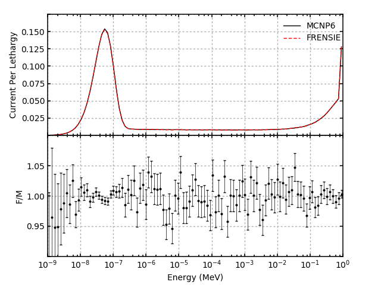

1. run `mcnp6 i=sphere_mcnp.i o=sphere_mcnp.o tasks 8`
2. run `export DATABASE_PATH=path-to-db`
2. run `./sphere.py --db_path=$DATABASE_PATH --sim_name="sphere" --num_particles=1e8 --threads=8`
3. run `./sphere-plot.py --rendezvous_file="sphere_rendezvous_10.xml" --estimator_id=1 --entity_id=1 --mcnp_file=sphere_mcnp.o --mcnp_file_start=242 --mcnp_file_end=342 --current`

4. run `./sphere-plot.py --rendezvous_file="sphere_rendezvous_10.xml" --estimator_id=2 --entity_id=1 --mcnp_file=sphere_mcnp.o --mcnp_file_start=408 --mcnp_file_end=508 --flux`
